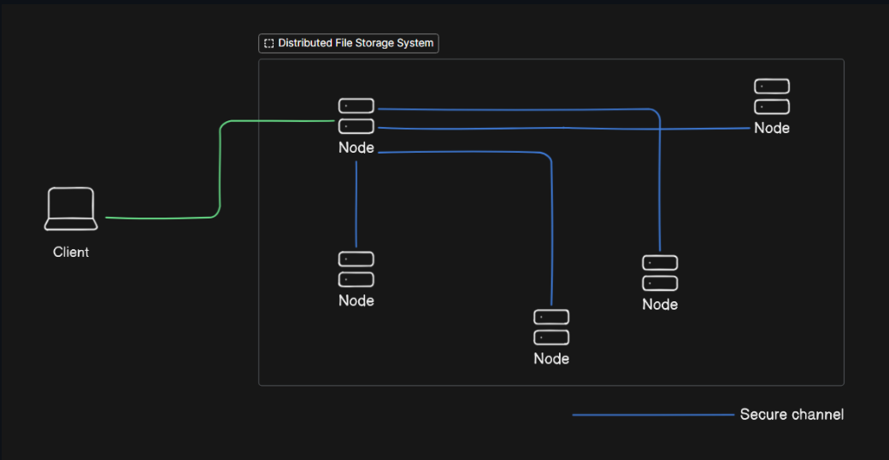

# 🗂️ Distributed Content-Addressable Storage (CAS)

A high-level diagram of the system:



A distributed file storage system built in Go that implements content addressing through cryptographic hashing. Files are stored using their SHA-1 hash as identifiers and automatically replicated across peer nodes. The system provides decentralized storage with built-in redundancy and fault tolerance.

## 🚀 Overview

This system eliminates the need for traditional file paths by using cryptographic hashes as file addresses. When you store a file, the system calculates its SHA-1 hash and uses that as the unique identifier. The file is then distributed across the network of connected nodes, ensuring it's available even if some nodes go offline. This approach provides data integrity verification, automatic deduplication, and eliminates single points of failure.

**What makes it special:**
- **No central server** - Files are shared directly between peers
- **Automatic replication** - Store once, available everywhere
- **Content verification** - Files are verified by their hash, ensuring integrity
- **Efficient storage** - Identical files are deduplicated automatically

## 🏗️ How It Works

1. **Store**: Files are hashed using SHA-1 and stored using the hash as the address
2. **Distribute**: Files are automatically replicated across connected peer nodes  
3. **Retrieve**: Files can be accessed from local storage or fetched from network peers
4. **Encrypt**: All network transfers are encrypted with AES-256

### File Storage Path Structure

```
Storage Path: /Saga/nodeId/abc12/3def4/56789.../abc123def456...
                │     │      │     │     │           │
                │     │      │     │     │           └── Full SHA-1 Hash
                │     │      │     │     └── 5-char chunks
                │     │      │     └── 5-char chunks  
                │     │      └── 5-char chunks
                │     └── Unique Node ID
                └── Storage Root Directory
```

## 🚀 Quick Start

```bash
# Clone and run demo (5 nodes)
git clone https://github.com/Eniimz/Distributed-File-Store.git
cd Distributed-File-Store
go run .
```

This starts a network of 5 nodes (ports 3001-7001) with automatic peer discovery.

## 🔧 Architecture

The system consists of interconnected nodes, each running:
- **FileServer**: Manages P2P connections and file operations
- **Store**: Content-addressable storage with hash-based organization
- **P2P Transport**: TCP networking for peer communication
- **Encryption**: AES-256 for secure data transmission

---
